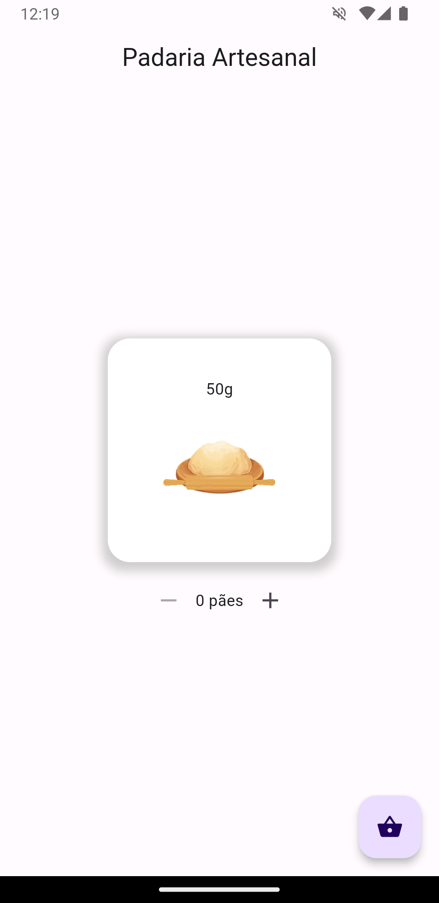
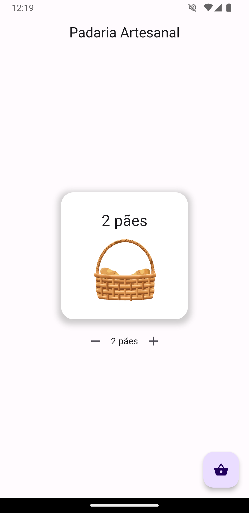
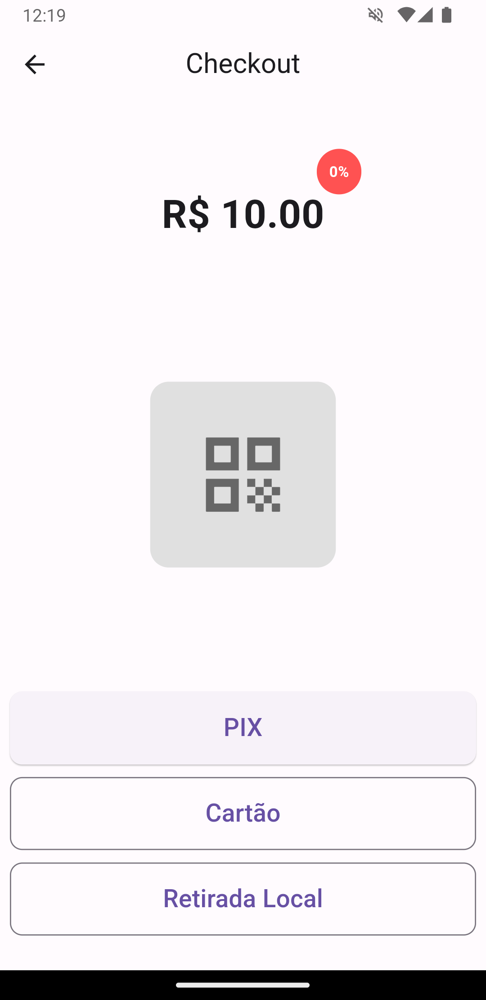
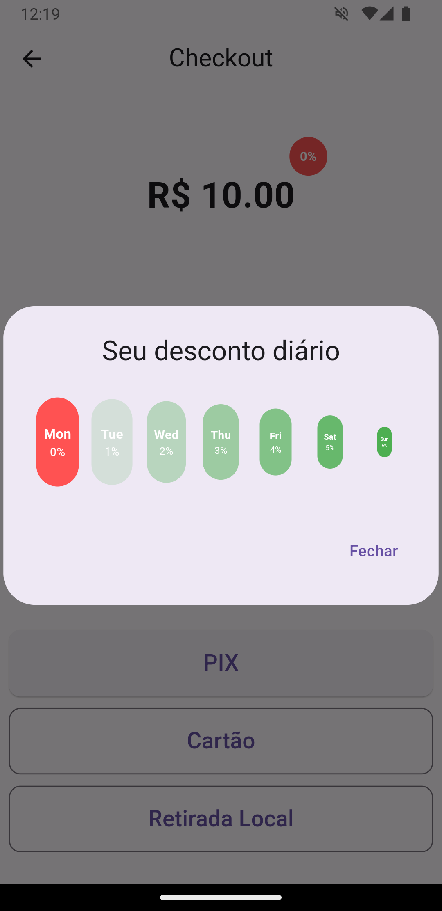

# Padaria Dona Rosa

Uma visão artesanal para vendas em padaria

## Começando

Esse projeto visa:

- Ajudar novos desenvolvedores

- Ajudar empreendedores no ramo de padaria

- Ajudar clientes a terem ótimas experiencias com app e bons preços

As featues visuais base são:

- Lista produtos com animações encantadoras

- Checkout Ágil para agilizar atendimento

- Programa de fidelização para maior beneficio de todas as partes.

## As telas

